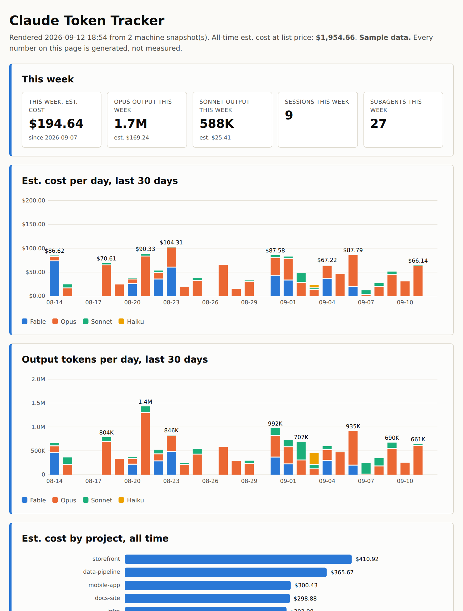

# Claude Token Tracker

A single-file usage dashboard for [Claude Code](https://claude.com/claude-code).
It reads the transcripts Claude Code already writes on your machine, boils
them down to counts, and renders a static page: what ran, on which model, in
which project, what every subagent was for, and what it all would cost at
public list price.

No dependencies. No server. No JavaScript in the output. One Python file.

[**Live demo**](https://donaldgallianoiii.github.io/token-tracker/) (generated sample data)



## Why

Claude Code spawns subagents, and subagents spend tokens you never see in
the terminal. The numbers are all on disk, per API call, with the model and
the four-way token split. This script makes them readable, and it makes the
one figure that matters to most people, "what did this week cost," a single
tile at the top of a page.

## Run it

```
git clone https://github.com/DonaldGallianoIII/token-tracker
cd token-tracker
python3 token_report.py
```

Open `html/index.html`. That's it. Python 3.10 or newer, nothing to install.

To see the dashboard without touching your own transcripts:

```
python3 token_report.py sample                  # writes examples/sample-host.jsonl
python3 token_report.py render --data examples  # renders it to html/
```

## What's on the page

- **This week**: estimated cost, output tokens per model family, sessions
  and subagents since Monday.
- **Per day, last 30 days**: cost and output tokens, stacked by model.
- **By project**: where the money went.
- **By model**: calls and the four token counts, all time.
- **Sessions**: the top 40 by cost, with titles, so you can find the
  expensive afternoon.
- **Subagents**: every agent, the one-line description it was spawned with,
  its model, tool uses, time, and cost.
- **Machines**: which snapshots were merged and when.
- **How the estimate works**: the rate table and its date.

## Two commands, one file

```
python3 token_report.py collect   # scan transcripts, write data/<hostname>.jsonl
python3 token_report.py render    # merge data/*.jsonl, write html/index.html
python3 token_report.py           # both
```

`collect` streams every transcript line by line and keeps one small record
per session (or subagent), per model, per day. A month of heavy use is a few
hundred kilobytes.

## More than one machine

Each machine writes its own snapshot, named by hostname. `render` merges
every snapshot it finds in `data/`, so the only job is getting the files
into one folder. Sync `data/` through a private git repo or a synced
folder; each machine only ever rewrites its own file, so nothing conflicts.

Snapshots hold counts, timestamps, model ids, session titles, and subagent
descriptions. They do not hold conversation text. They do reveal what you
were working on, which is why `data/*.jsonl` is git-ignored here and should
stay private wherever you keep it.

## What the numbers mean

Every Claude API call reports four token counts. Their prices are up to
200x apart, so the dashboard never adds them together:

| Count | What it is | Price relative to input |
|---|---|---|
| Input | Fresh tokens the model read for the first time | 1x |
| Output | Tokens the model wrote, including its thinking | 5x |
| Cache write | Tokens stored for reuse in later calls | 1.25x (5 min) or 2x (1 hour) |
| Cache read | Tokens re-read from cache | 0.1x, or 0.025x on Claude Fable 5.1 |

Long agentic sessions are almost all cache reads. That is why a session can
show tens of millions of tokens and a modest dollar figure.

**The dollar figures are estimates at public list price.** If you use Claude
Code on a subscription, you are not billed per token; the estimate is for
comparing runs and models with each other. Rates live in `CONFIG["Rates"]`
in the script, with the date they were read from the pricing page.

## Where the data comes from

- Main sessions: `~/.claude/projects/<project>/<session-id>.jsonl`
- Subagents: `~/.claude/projects/<project>/<session-id>/subagents/agent-*.jsonl`,
  plus a `.meta.json` beside each with the agent type, model, and description.

Every assistant message in those files carries `message.model` and
`message.usage`. If Claude Code moves the files, change
`CONFIG["ProjectsDir"]` or pass `--projects <dir>`.

## Accessibility

The page was built to be read without color. Model identity is carried by a
fixed color per family, a legend with text labels, a fixed stacking order
(Fable always at the bottom, then Opus, Sonnet, Haiku), a hover title on
every bar segment, and a table under every chart. The palette passes an
automated colorblind-separation check on the light surface; the two lighter
hues are always paired with direct labels. It was verified in greyscale
before release.

## Design notes

- A script, not an agent. An agent can only see its own token counts. The
  numbers for every agent are on disk, and a script reads them for free.
- Snapshots are aggregated, not raw. One row per session-or-agent, per
  model, per local day is enough for every view on the page and small
  enough to sync.
- No JavaScript. The charts are inline SVG generated by Python. The page
  works from a file:// URL, in a sandbox, and in a locked-down browser.
- Everything tunable is in `CONFIG` at the top of the file: paths, rates,
  chart window, table lengths, the palette.

## License

MIT. See `LICENSE`.
